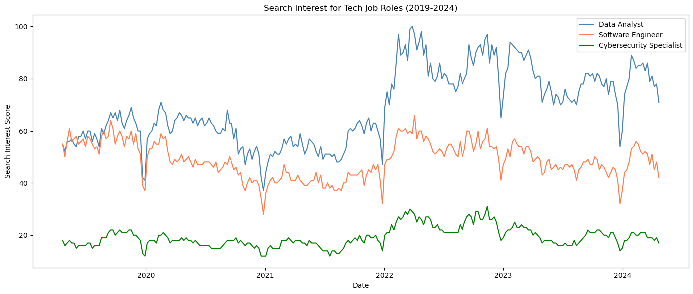
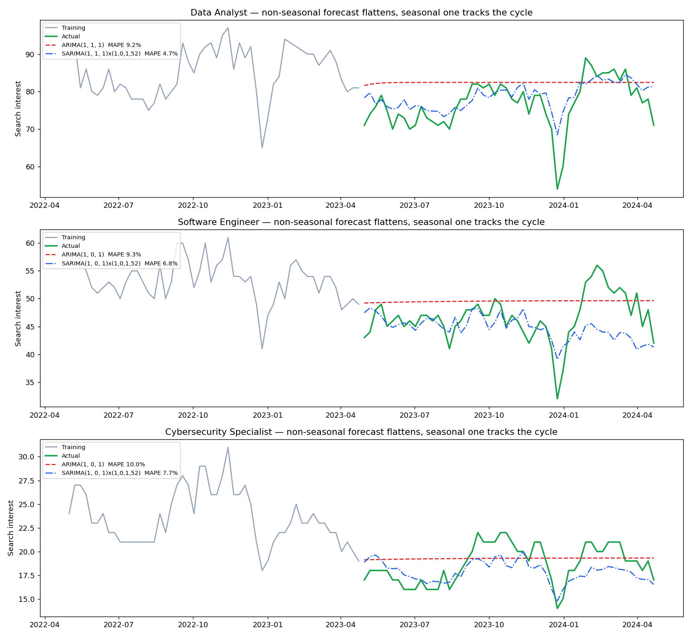
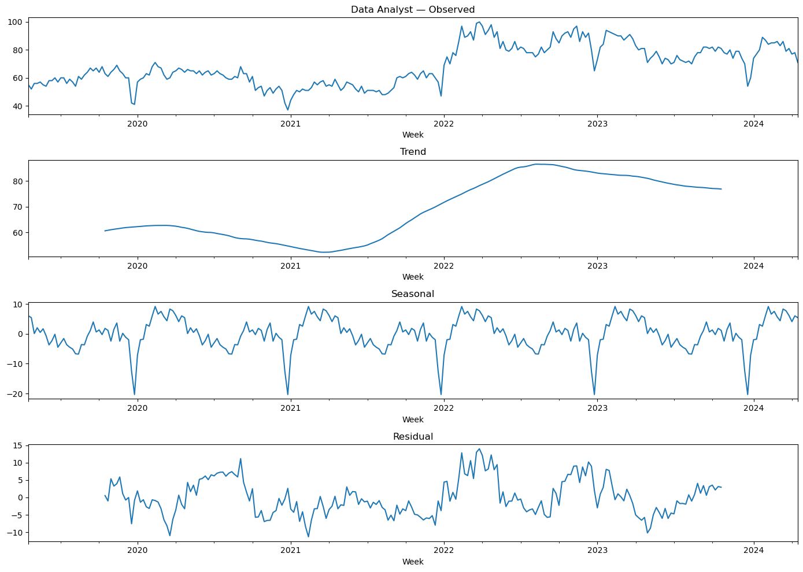
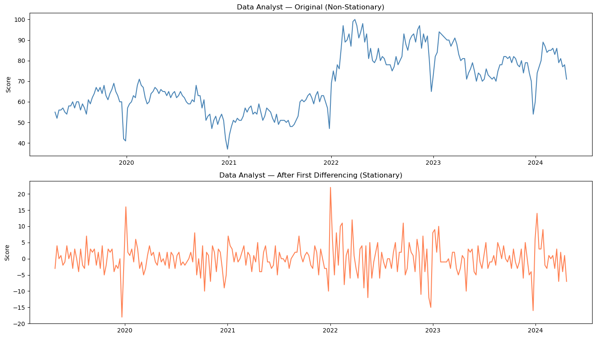
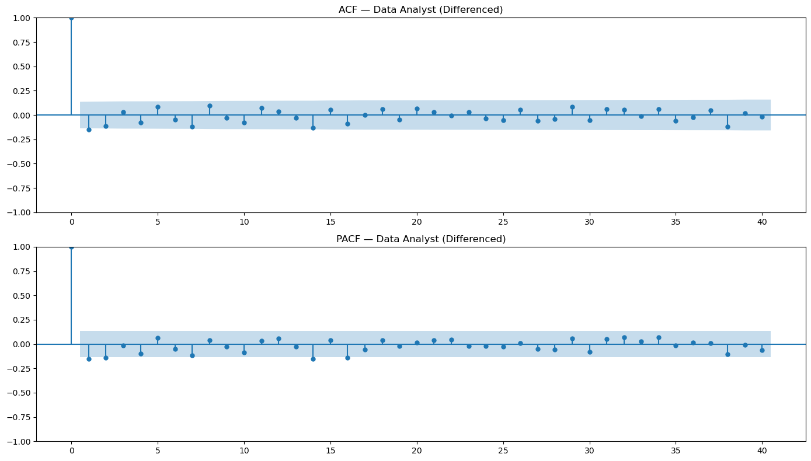
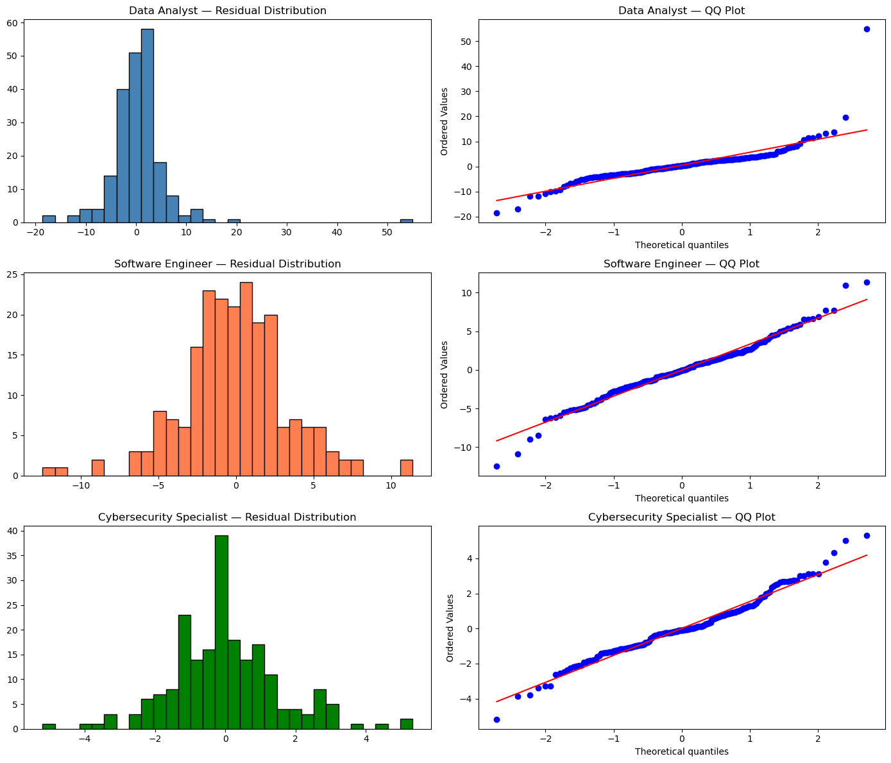
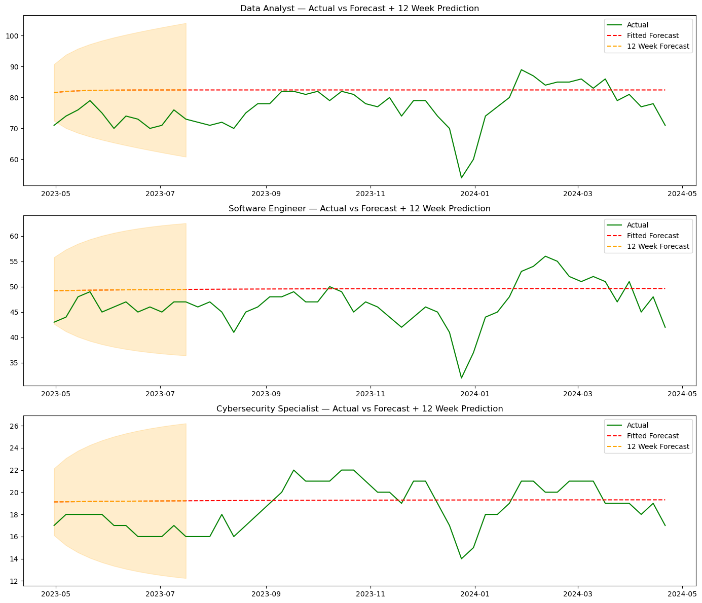

# Forecasting Demand for Tech Job Roles

Time series analysis and forecasting of weekly search interest for three technology roles —
Data Analyst, Software Engineer and Cybersecurity Specialist — over five years, from April 2019
to April 2024.

Search interest is used as a proxy for career awareness and hiring relevance, so a forecast of
it is useful for workforce planning and curriculum design.

<p align="center">
  
</p>

---

## The headline result

The three non-seasonal ARIMA models fitted in the notebooks forecast a flat line. That is not a
coding error — a non-seasonal ARIMA has no mechanism to repeat an annual pattern, so its long
horizon forecast converges on the series mean.

The decomposition showed a clear annual cycle in all three series, which meant that flat line
was leaving real signal on the table. Refitting the same orders with a seasonal component added
roughly halves the error:

| Role | ARIMA RMSE | SARIMA RMSE | ARIMA MAPE | SARIMA MAPE |
|---|---|---|---|---|
| Data Analyst | 8.46 | **4.55** | 9.24% | **4.67%** |
| Software Engineer | 5.06 | **4.50** | 9.29% | **6.76%** |
| Cybersecurity Specialist | 2.08 | **1.72** | 9.95% | **7.72%** |

<p align="center">
  
</p>

The red dashed line is the non-seasonal forecast flattening within weeks. The blue line is the
seasonal model, which tracks the real cycle — including the sharp December–January dip that
recurs every year as hiring slows over the holidays.

Reproduce with:

```bash
python seasonal_comparison.py
```

---

## Method

### 1. Exploration and stationarity
[`notebooks/01-exploration-and-stationarity.ipynb`](notebooks/01-exploration-and-stationarity.ipynb)

Each series is decomposed into trend, seasonal and residual components. All three show a
pronounced annual cycle, and Data Analyst carries a strong upward trend from 2021 onwards.

<p align="center">
  
</p>

Stationarity is tested with the Augmented Dickey-Fuller test. Data Analyst is non-stationary
because of that trend, and first differencing resolves it:

<p align="center">
  
</p>

### 2. Model selection and fitting
[`notebooks/02-model-selection-and-fitting.ipynb`](notebooks/02-model-selection-and-fitting.ipynb)

The data is split with the final 52 weeks held out, so the models are evaluated on a full unseen
year rather than an arbitrary fraction.

ARIMA orders are chosen by reading the ACF and PACF plots — the ACF tail-off with a single
significant PACF spike points to an AR(1) term, and the differencing order follows from the
stationarity testing above:

<p align="center">
  
</p>

| Role | Model | Why |
|---|---|---|
| Data Analyst | ARIMA(1,1,1) | Non-stationary, so d = 1 |
| Software Engineer | ARIMA(1,0,1) | Already stationary |
| Cybersecurity Specialist | ARIMA(1,0,1) | Already stationary |

### 3. Diagnostics and forecasting
[`notebooks/03-diagnostics-and-forecasting.ipynb`](notebooks/03-diagnostics-and-forecasting.ipynb)

Residuals are checked for structure the model failed to capture, using the Ljung-Box test,
histograms and Q-Q plots.

| Role | Ljung-Box p | Verdict |
|---|---|---|
| Data Analyst | 0.982 | Residuals are white noise |
| Software Engineer | 0.218 | Residuals are white noise |
| Cybersecurity Specialist | **0.037** | Fails at 5% — structure remains |

That third result is consistent with the flat-forecast problem: the model has not captured the
seasonality still present in the residuals, which is exactly what the seasonal model addresses.

<p align="center">
  
</p>

Twelve-week forecasts with confidence intervals:

<p align="center">
  
</p>

---

## What the data shows

- **Data Analyst is the most searched role throughout**, and grew sharply from early 2021,
  peaking around mid-2022.
- **All three series share the same annual rhythm** — a deep trough every December and January,
  and recovery through the first quarter. Interest in careers follows the hiring calendar.
- **Cybersecurity Specialist has the lowest volume but the steadiest growth**, roughly doubling
  its baseline across the five years.
- **The COVID period is visible** as a sharp dip across all three roles in early 2020.

---

## Techniques used

| Area | Applied |
|---|---|
| Decomposition | Trend, seasonal and residual separation |
| Stationarity | Augmented Dickey-Fuller test, first differencing |
| Model identification | ACF and PACF interpretation |
| Models | ARIMA, SARIMA with a 52-week seasonal period |
| Diagnostics | Ljung-Box test, residual histograms, Q-Q plots |
| Evaluation | MSE, RMSE, MAE, MAPE on a held-out year |
| Validation | Train-test split preserving time order, no shuffling |

---

## Running it

```bash
pip install pandas numpy matplotlib seaborn statsmodels scikit-learn jupyter
```

The notebooks read `data/tech_roles_trends.csv` relative to the repository root:

```bash
jupyter notebook notebooks/
```

The seasonal comparison runs on its own:

```bash
python seasonal_comparison.py
```

## Data

`data/tech_roles_trends.csv` — 262 weekly observations from 21 April 2019 to 23 April 2024, with
a relative search interest score for each of the three roles.

## What I would do next

- **Grid search the seasonal orders.** The comparison uses a single (1,0,1,52) configuration
  chosen to match the non-seasonal orders. A search over p, d, q and their seasonal counterparts,
  ranked by AIC, would likely do better still.
- **Add exogenous regressors.** Tech layoff announcements and graduate intake cycles plausibly
  drive some of the variance that is currently unexplained.
- **Try Prophet or an LSTM** as a comparison against the classical approach.
- **Use rolling-origin cross-validation** rather than a single holdout, so the accuracy figures
  are less dependent on which year happened to be held out.

## Licence

Released under the MIT Licence. See [LICENSE](LICENSE).
